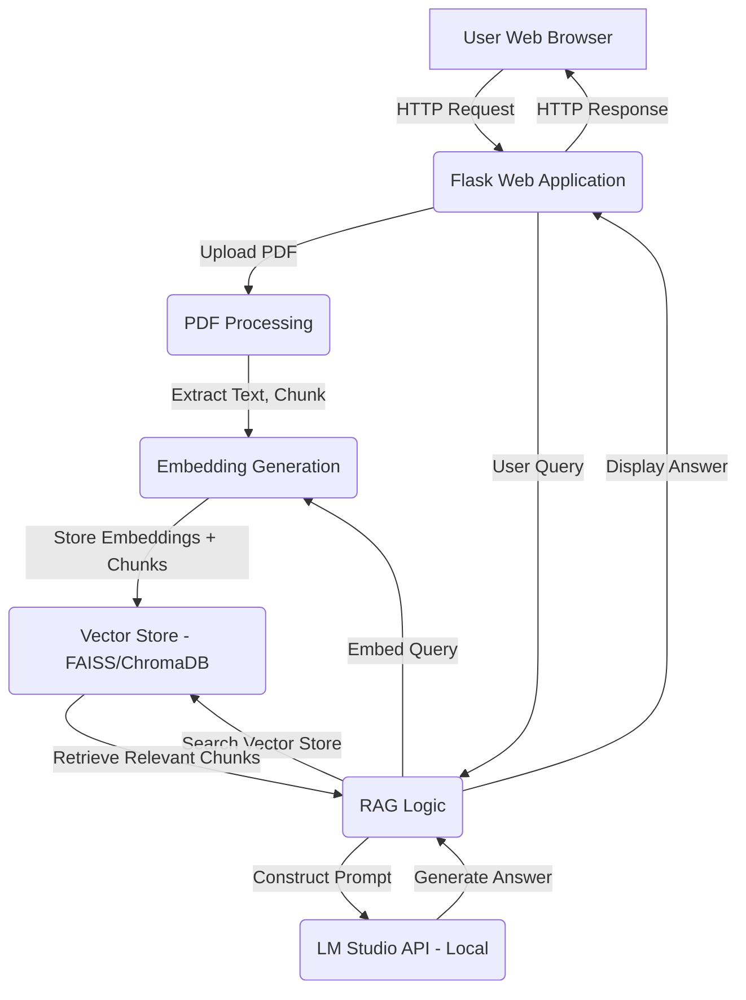

# RAG PDF Chatbot

A Flask-based web application for Retrieval Augmented Generation (RAG) that allows users to upload PDF documents, ask questions, and receive answers powered by a local LM Studio API. This application demonstrates how to build a simple RAG system for document Q&A.

## Features

*   **PDF Text Extraction:** Extracts text content from uploaded PDF documents.
*   **Text Chunking:** Divides extracted text into smaller, manageable chunks for efficient retrieval.
*   **Embedding Generation:** Uses `sentence-transformers` (`all-MiniLM-L6-v2` model) to create vector embeddings for text chunks and user queries.
*   **Vector Search:** Utilizes FAISS (Facebook AI Similarity Search) for fast similarity search to retrieve relevant document chunks based on user questions.
*   **LM Studio Integration:** Connects to a locally running LM Studio API (compatible with OpenAI API) for Large Language Model (LLM) inference to generate answers.
*   **Web Interface:** A user-friendly web interface built with Flask and Tailwind CSS for uploading PDFs and interacting with the chatbot.

## Technologies Used

*   **Backend:** Python 3, Flask
*   **PDF Processing:** `pypdf`
*   **Embeddings:** `sentence-transformers`
*   **Vector Store:** `faiss-cpu`
*   **API Calls:** `requests`
*   **Frontend:** HTML, JavaScript, Tailwind CSS (via CDN)
*   **LLM Serving:** LM Studio (local API)

## Architecture Diagram



## Setup Instructions

### Prerequisites

*   **Python 3.x:** Ensure Python is installed on your system.
*   **LM Studio:** Download and install [LM Studio](https://lmstudio.ai/). Make sure you have a model downloaded and running its local API server (usually on `http://localhost:1234`).

### Clone the Repository

First, clone the repository to your local machine:

```bash
git clone https://github.com/biswatma/zeropdf-rag.git
cd zeropdf-rag
```

### Install Dependencies

Navigate into the `rag_app` directory and install the required Python packages:

```bash
cd rag_app
pip install -r requirements.txt
```

*(Note: If `pip` doesn't work, try `pip3`.)*

## Usage

1.  **Start LM Studio API Server:**
    Ensure your LM Studio application is running and its local API server is active (default endpoint: `http://localhost:1234/v1`).

2.  **Run the Flask Application:**
    From the `rag_app` directory, run the Flask application:

    ```bash
    python app.py
    ```
    *(Note: If `python` doesn't work, try `python3`.)*

    You will see output indicating the Flask server is running, typically on `http://127.0.0.1:5000/`.

3.  **Access the Web Interface:**
    Open your web browser and navigate to `http://127.0.0.1:5000/`.

4.  **Upload a PDF:**
    *   In the "Upload PDF" section, click "Choose File" and select a PDF document from your computer.
    *   Click the "Upload and Process PDF" button.
    *   A status message will confirm if the PDF was processed successfully. The application will extract text, chunk it, and create embeddings for retrieval.

5.  **Ask a Question:**
    *   Once the PDF is processed, type your question related to the PDF's content into the input field in the "Ask a Question" section.
    *   Click the "Send" button (or press Enter).
    *   The application will retrieve relevant chunks from the uploaded PDF and send them along with your question to the LM Studio API to generate an answer. The answer will appear in the chatbox.

## Troubleshooting

*   **`ModuleNotFoundError` or `pip` issues:** Ensure you are using the correct Python executable (`python` or `python3`) and that `pip` is installing packages into the correct environment.
*   **"Could not connect to LM Studio API" error:** Verify that LM Studio is running and its local API server is active on `http://localhost:1234`. Check LM Studio's settings for the API server status.
*   **No response from chatbot:** Ensure the PDF was uploaded and processed successfully. Check the Flask console for any errors during the question-answering process.
